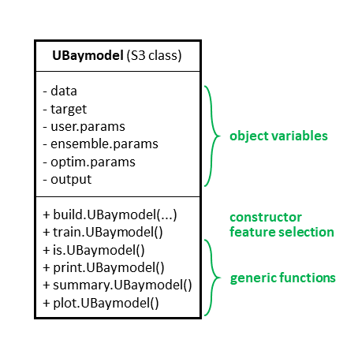
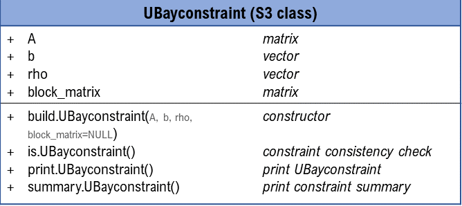
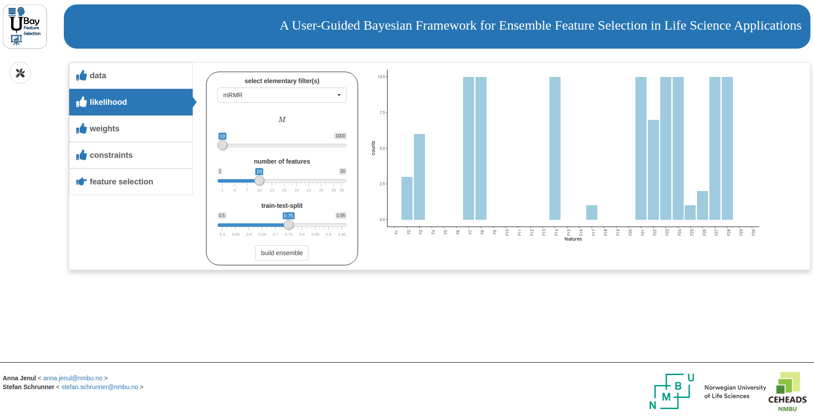

<style>
  body {
  text-align: justify;
  padding: 1em}
  header:after {
    content: '';
    position: absolute;
    top: 55px;
    right: 40px;
    width: 120px;
    height: 120px;
    background-image:url('logo.png');
    background-size:120px;
  }
</style>


```{r, include = FALSE}
library(knitr)
knitr::opts_chunk$set(
  collapse = TRUE,
  comment = '#>'
)
knitr::opts_chunk$set(fig.height = 5)
knitr::opts_chunk$set(fig.width = 8)
knitr::opts_chunk$set(fig.align = 'center')
```

```{r, include = FALSE, fig.show=FALSE}

```

# Introduction
The UBayFS package implements the framework proposed in [@jenul2022ubayfs], together with an interactive Shiny dashboard, which makes UBayFS applicable to R-users with different levels of expertise. UBayFS is an ensemble feature selection technique embedded in a Bayesian statistical framework. The method combines data and user knowledge, where the first is extracted via data-driven ensemble feature selection. The user can control the feature selection by assigning prior weights to features and penalizing specific feature combinations. In particular, the user can define a maximum number of selected features and must-link constraints (features must be selected together) or cannot-link constraints (features must not be selected together). A parameter $\rho$ regulates the shape of a penalty term accounting for side constraints, where feature sets that violate constraints lead to a lower target value. 

In this vignette, we use the Breast Cancer Wisconsin dataset [@wolberg:wisconsin] for demonstration. Specifically, the dataset consists of 569 samples and 30 features and can be downloaded as a demo dataset by calling ``data(bcw)``. The dataset describes a classification problem, where the aim is to distinguish between malignant and benign cancer based on image data. Features are derived from 10 image characteristics, where each characteristic is represented by three features (summary statistics) in the dataset. For instance, the characteristic *radius* is represented by features *radius mean*, *radius standard deviation*, and *radius worst*.


UBayFS is implemented via a core S3-class ``UBaymodel``, along with help functions. An overview of the 'UBaymodel' class and its main generic functions is shown in the following diagram:

```{r, out.width='70%', out.height='70%', fig.align='center', echo = FALSE}

``` 

## Requirements and dependencies
- R (>= 3.5.0)
- GA
- matrixStats
- shiny
- mRMRe
- Rdimtools
- DirichletReg
- ggplot2
- gridExtra
- utils
- hyper2
- methods

In addition, some functionality of the package (in particular, the interactive Shiny interface) requires the following dependencies:

- shinyWidgets
- shinyalert
- DT
- RColorBrewer
- tcltk
- shinyjs
- shinythemes
- shinyBS
- testthat (>= 3.0.0)
- rmarkdown
- dplyr
- plyr
- knitr

Like other R packages, UBayFS is loaded using the ``library(UBayFS)`` command. The sample dataset is accessed via ``data(bcw)``.
```{r, include = TRUE}
library(UBayFS)
data(bcw)
```

# Background
This section summarizes the core parts of UBayFS, where a central part is Bayes' Theorem for two random variables $\boldsymbol{\theta}$ and $\boldsymbol{y}$:
$$p(\boldsymbol{\theta}|\boldsymbol{y})\propto p(\boldsymbol{y}|\boldsymbol{\theta})\cdot p(\boldsymbol{\theta}),$$ where $\boldsymbol{\theta}$ represents an importance parameter of single features and $\boldsymbol{y}$ collects evidence about $\boldsymbol{\theta}$ from an ensemble of elementary feature selectors. In the following, the concept will be outlined. 

## Ensemble feature selection as likelihood
The first step in UBayFS is to build $M$ ensembles of elementary feature selectors. Each elementary feature selector $m=1,\dots,M$ selects features, denoted by a binary membership vector $\boldsymbol{\delta}^{(m)} \in \{0,1\}^N$, based on a randomly selected training dataset, where $N$ denotes the total number of features in the dataset. In the binary membership vector $\boldsymbol{\delta}^{(m)}$, a component $\delta_i^{(m)}=1$ indicates that feature $i\in\{1,\dots,N\}$ is selected, and $\delta_i^{(m)}=0$ otherwise. Statistically, we interpret the result from each elementary feature selector as a realization from a multinomial distribution with parameters $\boldsymbol{\theta}$ and $l$, where $\boldsymbol{\theta}\in[0,1]^N$ defines the success probabilities of sampling each feature in an individual feature selection and $l$ corresponds to the number of features selected in $\boldsymbol{\delta}^{(m)}$. Therefore, the joint probability density of the observed data $\boldsymbol{y} = \sum\limits_{m=1}^{M}\boldsymbol{\delta}^{(m)}\in\{0,\dots,M\}^N$ --- the likelihood function --- has the form 
$$ p(\boldsymbol{y}|\boldsymbol{\theta}) = \prod\limits_{m=1}^{M} f_{\text{mult}}(\boldsymbol{\delta}^{(m)};\boldsymbol{\theta},l),$$
where $f_{\text{mult}}$ is the probability density function of the multinomial distribution.

## Expert knowledge as prior
UBayFS includes two types of expert knowledge: prior feature weights and feature set constraints. 

### Prior feature weights

To introduce expert knowledge about the importance of features, the user may define a vector $\boldsymbol{\alpha} = (\alpha_1,\dots,\alpha_N)$, $\alpha_i>0$ for all $i=1,\dots,N$, assigning a weight to each feature. High weights indicate that a feature is important. By default, if all features are equally important or no prior weighting is used, $\boldsymbol{\alpha}$ is set to the 1-vector of length $N$. With the weighting in place, we assume the a-priori feature importance parameter $\boldsymbol{\theta}$ follows a Dirichlet distribution [@R:DirichletReg]
$$p(\boldsymbol{\theta}) = f_{\text{Dir}}(\boldsymbol{\theta};\boldsymbol{\alpha}),$$
where the probability density function of the Dirichlet distribution is given as
$$f_{\text{Dir}}(\boldsymbol{\theta};\boldsymbol{\alpha}) = \frac{1}{\text{B}(\boldsymbol{\alpha})} \prod\limits_{n=1}^N \theta_n^{\alpha_n-1},$$
where $\text{B}(.)$ denotes the multivariate Beta function. Generalizations of the Dirichlet distribution [@wong:gdirichlet,@hankin:hyperdirichlet] are also implemented in UBayFS.

Since the Dirichlet distribution is the conjugate prior with respect to a multivariate likelihood, the posterior density is given as
$$p(\boldsymbol{\theta}|\boldsymbol{y}) \propto f_{\text{Dir}}(\boldsymbol{\theta};\boldsymbol{\alpha}^\circ),$$
with
$$\boldsymbol{\alpha}^\circ = \left( \alpha_1 + \sum\limits_{m=1}^M \delta_1^{(m)}, \dots, \alpha_N + \sum\limits_{m=1}^M \delta_N^{(m)}  \right)$$
representing the posterior parameter vector $\boldsymbol{\alpha}^\circ$.

### Feature set constraints
In addition to the prior weighting of features, the UBayFS user can also add different types of constraints to the feature selection:

- *max-size constraint*: Maximum number of features that shall be selected.
- *must-link constraint*: For a pair of features, either both or none is selected (defined as pairwise constraints, one for each pair of features).
- *cannot-link constraint*: Used if a pair of features must not be selected jointly.

All constraints can be defined *block-wise* between feature blocks (instead of individual features).
Constraints are represented as a linear system of linear inequalities $\boldsymbol{A}\boldsymbol{\delta}-\boldsymbol{b}\leq \boldsymbol{0}$, where $\boldsymbol{A}\in\mathbb{R}^{K\times N}$ and $\boldsymbol{b}\in\mathbb{R}^K$. $K$ denotes the total number of constraints. For constraint $k \in 1,..,K$, a feature set $\boldsymbol{\delta}$ is admissible only if $\left(\boldsymbol{a}^{(k)}\right)^T\boldsymbol{\delta} - b^{(k)} \leq 0$, leading to the inadmissibility function (penalty term)

\begin{align}
\kappa_{k,\rho}(\boldsymbol{\delta}) = \left\{
    \begin{array}{l l}
    0 & \text{if}~\left(\boldsymbol{a}^{(k)}\right)^T\boldsymbol{\delta}\leq b^{(k)}\\
    1 & \text{if}~ \left(\boldsymbol{a}^{(k)}\right)^T\boldsymbol{\delta}> b^{(k)} \land \rho =\infty\\
    \frac{1-\xi_{k,\rho}}{1 + \xi_{k,\rho}} & \text{otherwise},
    \end{array}
    \right.
\end{align}
    
where $\rho\in\mathbb{R}^+ \cup \{\infty\}$ denotes a relaxation parameter and
$\xi_{k,\rho} = \exp\left(-\rho \left(\left( \boldsymbol{a}^{(k)}\right)^T\boldsymbol{\delta} - b^{(k)}\right)\right)$ defines the exponential term of a logistic function. To handle $K$ different constraints for one feature selection problem, the joint inadmissibility function is given as
$$ \kappa(\boldsymbol{\delta})
    = 1 - \prod\limits_{k=1}^{K} \left(1 -\kappa_{k,\rho}(\boldsymbol{\delta})\right)$$
which originates from the idea that $\kappa = 1$ (maximum penalization) if at least one $\kappa_{k,\rho}=1$, while $\kappa=0$ (no penalization) if all $\kappa_{k,\rho}=0$. 

To obtain an optimal feature set $\boldsymbol{\delta}^\star$, we use a target function $U(\boldsymbol{\delta}, \boldsymbol{\theta})$ which represents a posterior expected utility of feature sets $\boldsymbol{\delta}$ given the posterior feature importance parameter $\boldsymbol{\theta}$, regularized by the inadmissibility function $\kappa(.)$.

$$\mathbb{E}_{\boldsymbol{\theta}|\boldsymbol{y}}[U(\boldsymbol{\delta}, \boldsymbol{\theta}(\boldsymbol{y}))] = \boldsymbol{\delta}^T \mathbb{E}_{\boldsymbol{\boldsymbol{\delta}}|\boldsymbol{y}}[\boldsymbol{\theta}(\boldsymbol{y})]-\lambda\kappa(\boldsymbol{\delta})\longrightarrow \underset{\boldsymbol{\delta}\in\{0,1\}^N}{\text{arg max}}
$$
    
Since an exact optimization is impossible due to the non-linear function $\kappa$, we use a genetic algorithm to find an appropriate feature set. In detail, the genetic algorithm is initialized via a Greedy algorithm and computes combinations of the given feature sets with regard to a fitness function in each iteration.

# Application of UBayFS
 
## Ensemble Training
The function ``build.UBaymodel()`` initializes the UBayFS model and trains an ensemble of elementary feature selectors. The training dataset and target are initialized with the arguments ``data`` and ``target``. Although the UBayFS concept permits unsupervised, multiclass, or regression setups, the current implementation supports binary target variables only. While ``M`` defines the ensemble size (number of elementary feature selectors), the types of the elementary feature selectors is set via ``method``. Three different feature selectors (mRMR, Fisher schore and Laplace score) are implemented as baseline. In general, the ``method`` argument allows for each self-implemented feature selection function with the arguments ``X`` (describes the data), ``y`` (describes the target), ``n`` (describes the number of features that shall be selected), and ``name`` (name of the method). The function must return the indices of the selected features and the input name. An example with classification trees is shown below. Each ensemble model is trained on a random subset comprising ``tt_split``$\cdot 100$ percent of the train data. The help function ``buildConstraints()`` provides an easy way to define side constraints for the model. Using the argument ``prior_model`` the user specifies whether the standard Dirichlet distribution or a generalized variant should be used as prior model. Furthermore, the number of features selected in each ensemble can be controlled by the parameter ``nr_features``.

For the standard UBayFS initialization, all prior feature weights are set to 1, and no feature constraints are included yet. The ``summary()`` function provides an overview of the dataset, the prior weights, and the likelihood --- ensemble counts indicate how often a feature was selected over the ensemble feature selections. 
```{r, include = TRUE}
model = build.UBaymodel(data = bcw$data,
                        target = bcw$labels,
                        M = 100, 
                        tt_split = 0.75,
                        nr_features = 10,
                        method = 'mRMR',
                        prior_model ='dirichlet',
                        weights = 0.01,
                        lambda = 1,
                        constraints = buildConstraints(constraint_types = c('max_size'), 
                                                       constraint_vars = list(3), 
                                                       num_elements = dim(bcw$data)[2], 
                                                       rho = 1),
                        optim_method = 'GA',
                        popsize = 100,
                        maxiter = 100,
                        shiny = FALSE
                        )
summary(model)
```

The prior constraints are shown as a linear inequation system together with the penalty term $\rho$. Further, the current prior weight and the ensemble feature counts (likelihood) for each feature are printed. As the model is not trained yet, the final feature selection result is empty.

In addition to ``mRMR``, we add a function ``decision_tree()`` that computes features based on decision tree importances.

```{r, include = TRUE, eval=FALSE}

library(rpart)
decision_tree <- function(X, y, n, name = 'tree'){
  rf_data = as.data.frame(cbind(y, X))
  colnames(rf_data) <- make.names(colnames(rf_data))
  tree = rpart::rpart(y~., data = rf_data)
return(list(ranks= which(colnames(X) %in% names(tree$variable.importance)[1:n]),
            name = name))
}

model = build.UBaymodel(data = bcw$data,
                        target = bcw$labels,
                        M = 100, 
                        tt_split = 0.75,
                        nr_features = 10,
                        method = c('mRMR', decision_tree),
                        prior_model ='dirichlet',
                        weights = 0.01,
                        lambda = 1,
                        constraints = buildConstraints(constraint_types = c('max_size'), 
                                                       constraint_vars = list(3), 
                                                       num_elements = dim(bcw$data)[2], 
                                                       rho = 1),
                        optim_method = 'GA',
                        popsize = 100,
                        maxiter = 100,
                        shiny = FALSE
                        )
```

Examples for more feature selection methods are:

```{r, include=TRUE, eval=FALSE}

# recursive feature elimination
library(caret)
rec_fe <- function(X,y,n, name='rfe'){
  if(is.factor(y)){
        control <- rfeControl(functions=rfFuncs, method = 'cv', number = 2)
      }
      else{
        control <- rfeControl(functions=lmFuncs, method = 'cv', number = 2)
      }
      results <- caret::rfe(X, y, sizes = n, rfeControl=control)
      return(list(ranks = which(colnames(X) %in% results$optVariables),
                  name = name))
}

# Lasso
library(glmnet)
lasso <- function(X, y, n=NULL, name='lasso'){
  family = ifelse(is.factor(y), 'binomial', 'gaussian')
  cv.lasso <- cv.glmnet(as.matrix(X), y, intercept = FALSE, alpha = 1, family = family, nfolds=3)
  model <- glmnet(as.matrix(X), y, intercept = FALSE, alpha = 1, family = family,
                  lambda = cv.lasso$lambda.min)
  return(list(ranks = which(as.vector(model$beta) != 0),
              name = name))
}

# HSIC Lasso
library(GSelection)
hsic_lasso <- function(X, y, n, name='hsic'){
  ifelse(is.factor(y), {tl = as.numeric(as.integer(y)-1)}, {tl = y})
  results = feature.selection(X, tl, n)
  return(list(ranks = results$hsic_selected_feature_index,
              name = name))
}
```

## User knowledge
Using the function ``setWeights()`` the user is able to change the feature weights from the standard initialization to desired values. In our example, we assign equal weights to features originating from the same image characteristic. Weights can be on an arbitrary scale. As it is difficult to specify prior weights in real-life applications, we suggest to define them on a normalized scale.
```{r, include=TRUE}
weights = rep(c(10,15,20,16,15,10,12,17,21,14), 3)
strength = 1
weights = weights * strength / sum(weights)
print(weights)

model = setWeights(model = model, 
                   weights = weights)
```

In addition to prior weights, feature set constraints may be specified. Internally, constraints are implemented via an S3-class ``UBayconstraint``, depicted in the following diagram:

```{r, out.width='70%', out.height='70%', fig.align='center', echo = FALSE}

``` 

Rather than calling the constructor method directly, the help function ``buildConstraints()`` may be used to facilitate the definition of a set of constraints: the input ``constraint_types`` consists of a vector, where all constraint types are defined. Then, with ``constraint_vars``, the user specifies details about the constraint: for max-size, the number of features to select is provided, while for must-link and cannot-link, the set of feature indices to be linked must be provided. Each list entry corresponds to one constraint in ``constraint_types``. In addition, ``num_features`` denotes the total number of features in the dataset (or the total number of blocks if the constraint is block-wise) and ``rho`` corresponds to the relaxation parameter of the admissibility function. For block constraints, information about the block structure is included either with ``block_list``or ``block_matrix`` - if both arguments are ``NULL``, feature-wise constraints are generated.

Applying ``print(constraints)`` demonstrates that, the matrix ``A`` has ten rows to represent four constraints. While *max-size* and *cannot-link* can be expressed in one equation each, *must-link* is a pairwise constraint. In specific, the *must-link* constraint between $n$ features produces $\frac{n!}{(n-2)!}$ elementary constraints. Hence, six equations represent the *must-link* constraint. The function ``setConstraints()`` integrates the constraints into the UBayFS model. 
```{r, include=TRUE}
constraints = buildConstraints(constraint_types = c('max_size', 
                                                    'must_link', 
                                                    rep('cannot_link', 2)),
                               constraint_vars = list(10, # max-size (maximal 10 features)
                                                      c(1,11,21), # must-link between features 1, 11, and 21
                                                      c(1,10), # cannot-link between features 1, and 10
                                                      c(20,23,24)), # cannot-link between features 20, 23, and 24
                               num_elements = ncol(model$data),
                                rho = c(Inf, # max_size
                                        0.1, # rho for must-link
                                        1, # rho for first cannot-link
                                        1)) # rho for second cannot-link
print(constraints)

model = setConstraints(model = model, constraints = constraints)
```

## Optimization and evaluation
A genetic algorithm, described by [@givens:compstat] and implemented in [@R:GA], searches for the optimal feature set in the UBayFS framework. Using ``setOptim()`` we initialize the genetic algorithm. Furthermore, ``popsize`` indicates the number of candidate feature sets created in each iteration, and ``maxiter`` is the number of iterations. 

```{r, include=TRUE}
model = setOptim(model = model,
                 popsize = 100, 
                 maxiter = 200)

```

At this point, we have initialized prior weights, constraints, and the optimization procedure --- we can now train the UBayFS model using the generic function ``train()``, relying on a genetic algorithm. The ``summary()`` function provides an overview of all components of UBayFS. The ``plot()`` function shows the prior feature information as bar charts, with the selected features marked with red borders. In addition, the constraints and the regularization parameter $\rho$ are presented. 
```{r, include=TRUE, fig.width=7, fig.height=6}
model = UBayFS::train(x = model)
summary(model)
plot(model)
```
After training the model, we receive a feature selection result. More than one optimal feature set with the same MAP score is possible. The plot shows the selected features (red framed) and their selection distribution between ensemble feature selection and prior weights. The constraints are shown at the top, where a connecting line is drawn between features of one constraint.
The final feature set and its additional properties can be evaluated with ``evaluateFS()``:


```{r, include=TRUE}
# evaluation feature set
evaluateMultiple(state = model$output$feature_set, model = model)
```

The output contains the following information:

* **cardinality**: number of selected features
* **log total utility**: value of the target function for optimization
* **log posterior feature utility**: cumulated importances of selected features before substracting a penalization term
* **log admissibility**: if 0, all constraints are fulfilled, otherwise at least one constraint is violated
* **number violated constraints**: number of violated constraints
* **avg feature correlation**: average correlation between features in dataset


# Shiny dashboard
``UBayFS`` provides an interactive ``R Shiny`` dashboard as GUI. With its intuitive user interface, the user can load data, set likelihood parameters, and even control the admissibility regularization strength of each constraint. With the command ``runInteractive()``, the Shiny dashboard opens, given that the required depedencies are available (see above). Histograms and plots help to get an overview of the user's settings. The interactive dashboard offers ``save`` and ``load`` buttons to save or load UBayFS models as RData files. Due to computational limitations, it is not recommended to use the HTML interface for larger datasets ($> 100$ features or $>1000$ samples).

```{r,eval=FALSE}
runInteractive()
```

```{r, out.width='100%', echo = FALSE}

``` 

The dashboard includes multiple tabs:

 - **data**: Load the dataset and specify whether row names, column names or a block structure is present. A demo dataset is ready to be loaded and used for a first touch on the package.
 - **likelihood**: Select elementary feature selectors for ensemble feature selection, the number of models $M$, the number of features in each model, and the ratio of the train-test split. Further, the dashboard allows the user to mix different elementary feature selectors, although this option is not recommended due to limited stability [@seijo:ensembleSurvey].
 - **weights**: The prior feature weights are set by the user. For block feature selection, it is possible to set weights for blocks; otherwise, for a single feature.
 - **constraints / block constraints**: In this task, the user sets different constraints (at least a max-size constraint). The penalty $\rho$ can be varied here as well.
 - **feature selection**: In the dashboard's last step, an optimization procedure determines the final feature set. A plot of the final result is produced - also, the model can be saved as an Rdata file and loaded to the dashboard again.
 
# Conclusion
With the methodology in place, UBayFS is applicable to a large range of feature selection problems with multiple sources of information. The likelihood parameters, steering the number of elementary models, mainly affect the stability and runtime of the result --- the latter linearly increases with the number of models. Especially the Shiny dashboard delivers insight into the single UBayFS steps. Nevertheless, the dashboard only applies to smaller datasets, while larger ones should be computed in the console. 


# References


